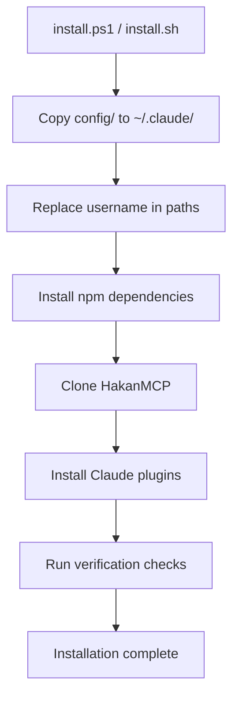
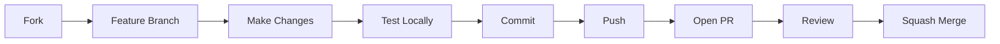

# Contributing to claude-code-dotfiles

> Thank you for your interest in contributing!
> This guide covers everything you need to get started.
> For installation, see [SETUP](SETUP.md). For security policy, see [SECURITY](SECURITY.md).

## Table of Contents

- [Prerequisites](#prerequisites)
- [Development Setup](#development-setup)
- [Project Architecture](#project-architecture)
- [Making Changes](#making-changes)
- [Commit Convention](#commit-convention)
- [Pull Request Flow](#pull-request-flow)
- [Code Style](#code-style)
- [Testing](#testing)
- [Release Process](#release-process)
- [Questions](#questions)

---

## Prerequisites

| Tool | Version | Check Command | Purpose |
|------|---------|---------------|---------|
| Node.js | >= 20 | `node --version` | Hook execution, GSD runtime |
| Python | >= 3.8 | `python --version` | Dippy hook, security skills |
| Git | >= 2.x | `git --version` | Version control |
| Claude Code | latest | `claude --version` | CLI that consumes this config |
| jq | any | `jq --version` | JSON processing in scripts |
| GitHub CLI | latest | `gh --version` | Fork, PR, release workflow |

---

## Development Setup

### 1. Fork & Clone

```bash
gh repo fork sudohakan/claude-code-dotfiles --clone
cd claude-code-dotfiles
```

### 2. Create a Feature Branch

```bash
git checkout -b feat/your-feature-name
```

### 3. Understand the Install Flow



> **Important:** Files in `config/` become `~/.claude/` after installation.
> Always test changes by running the installer locally.

### 4. Local Testing Setup

```bash
# Create a temporary test directory
mkdir /tmp/test-claude-dotfiles
# Run installer targeting test directory (don't overwrite your real config)
CLAUDE_DIR=/tmp/test-claude-dotfiles ./install.sh
```

---

## Project Architecture

<details>
<summary><strong>Where to put what</strong></summary>

| You want to... | Edit in... | Format |
|-----------------|-----------|--------|
| Add a slash command | `config/commands/your-command.md` | Markdown |
| Add a GSD command | `config/commands/gsd/your-command.md` | Markdown |
| Add/edit a hook | `config/hooks/your-hook.js` | JavaScript |
| Add a shared hook utility | `config/hooks/lib/your-util.js` | JavaScript |
| Add an agent definition | `config/agents/your-agent.md` | Markdown |
| Change global Claude rules | `config/CLAUDE.md` | Markdown |
| Add a skill set | `config/skills/your-skill/` | Directory |
| Update reference docs | `config/docs/your-doc.md` | Markdown |
| Change MCP server config | `home-config/.claude.json` | JSON |
| Change hook/plugin settings | `config/settings.json` | JSON |
| Add permission rules | `config/settings.local.json` | JSON |
| Update GSD runtime | `config/get-shit-done/` | JS (CommonJS) |
| Update file manifest | `config/gsd-file-manifest.json` | JSON |
| Modify the installer | `install.ps1` / `install.sh` | PowerShell / Bash |

</details>

<details>
<summary><strong>Directory structure overview</strong></summary>

```
claude-code-dotfiles/
├── config/                          # Copied to ~/.claude/ on install
│   ├── CLAUDE.md                    # Global Claude Code instructions
│   ├── settings.json                # Hook, MCP, permission settings
│   ├── settings.local.json          # Local permission rules
│   ├── package.json                 # GSD runtime npm dependencies
│   ├── project-registry.json        # Project registry config
│   ├── gsd-file-manifest.json       # GSD file manifest
│   │
│   ├── commands/                    # Slash commands
│   │   ├── browser.md               #   /browser
│   │   ├── commit.md                #   /commit
│   │   ├── create-pr.md             #   /create-pr
│   │   ├── dotfiles-update.md       #   /dotfiles-update
│   │   ├── fix-github-issue.md      #   /fix-github-issue
│   │   ├── fix-pr.md                #   /fix-pr
│   │   ├── init-hakan.md            #   /init-hakan
│   │   ├── release.md               #   /release
│   │   ├── run-ci.md                #   /run-ci
│   │   ├── ship.md                  #   /ship
│   │   └── gsd/                     #   GSD workflow commands (34 commands)
│   │       ├── add-phase.md         #     /gsd:add-phase
│   │       ├── add-tests.md         #     /gsd:add-tests
│   │       ├── add-todo.md          #     /gsd:add-todo
│   │       ├── audit-milestone.md   #     /gsd:audit-milestone
│   │       ├── auto-phase.md        #     /gsd:auto-phase
│   │       ├── check-todos.md       #     /gsd:check-todos
│   │       ├── cleanup.md           #     /gsd:cleanup
│   │       ├── complete-milestone.md#     /gsd:complete-milestone
│   │       ├── debug.md             #     /gsd:debug
│   │       ├── discuss-phase.md     #     /gsd:discuss-phase
│   │       ├── execute-phase.md     #     /gsd:execute-phase
│   │       ├── health.md            #     /gsd:health
│   │       ├── help.md              #     /gsd:help
│   │       ├── insert-phase.md      #     /gsd:insert-phase
│   │       ├── join-discord.md      #     /gsd:join-discord
│   │       ├── list-phase-assumptions.md  # /gsd:list-phase-assumptions
│   │       ├── map-codebase.md      #     /gsd:map-codebase
│   │       ├── new-milestone.md     #     /gsd:new-milestone
│   │       ├── new-project.md       #     /gsd:new-project
│   │       ├── pause-work.md        #     /gsd:pause-work
│   │       ├── plan-milestone-gaps.md#    /gsd:plan-milestone-gaps
│   │       ├── plan-phase.md        #     /gsd:plan-phase
│   │       ├── progress.md          #     /gsd:progress
│   │       ├── quick.md             #     /gsd:quick
│   │       ├── reapply-patches.md   #     /gsd:reapply-patches
│   │       ├── remove-phase.md      #     /gsd:remove-phase
│   │       ├── research-phase.md    #     /gsd:research-phase
│   │       ├── resume-work.md       #     /gsd:resume-work
│   │       ├── run-phase.md         #     /gsd:run-phase
│   │       ├── set-profile.md       #     /gsd:set-profile
│   │       ├── settings.md          #     /gsd:settings
│   │       ├── update.md            #     /gsd:update
│   │       ├── validate-phase.md    #     /gsd:validate-phase
│   │       └── verify-work.md       #     /gsd:verify-work
│   │
│   ├── hooks/                       # Event hooks (JavaScript)
│   │   ├── dotfiles-check-update.js #   Checks for dotfiles updates
│   │   ├── gsd-check-update.js      #   Checks for GSD updates
│   │   ├── gsd-context-monitor.js   #   Monitors context budget usage
│   │   ├── gsd-statusline.js        #   GSD status in notification bar
│   │   ├── post-autoformat.js       #   Auto-format after edits
│   │   ├── pretooluse-safety.js     #   Safety checks before tool use
│   │   ├── lib/                     #   Shared hook utilities
│   │   │   └── paths.js             #     Path resolution helpers
│   │   └── test/                    #   Hook test files
│   │
│   ├── agents/                      # Agent definitions (12 agents)
│   │   ├── gsd-codebase-mapper.md   #   Maps project codebase structure
│   │   ├── gsd-debugger.md          #   Systematic debugging agent
│   │   ├── gsd-executor.md          #   Phase execution agent
│   │   ├── gsd-integration-checker.md#  Integration verification
│   │   ├── gsd-nyquist-auditor.md   #   Quality audit agent
│   │   ├── gsd-phase-researcher.md  #   Phase-specific research
│   │   ├── gsd-plan-checker.md      #   Plan validation agent
│   │   ├── gsd-planner.md           #   Phase planning agent
│   │   ├── gsd-project-researcher.md#   Project-level research
│   │   ├── gsd-research-synthesizer.md#  Research synthesis
│   │   ├── gsd-roadmapper.md        #   Roadmap creation agent
│   │   └── gsd-verifier.md          #   Work verification agent
│   │
│   ├── skills/                      # Skill sets (4 sets)
│   │   ├── cc-devops-skills/        #   DevOps automation skills
│   │   │   ├── LICENSE
│   │   │   ├── README.md
│   │   │   └── devops-skills-plugin/
│   │   ├── community-skills/        #   Community skills
│   │   │   └── ...
│   │   ├── trailofbits-security/    #   Trail of Bits security skills
│   │   │   ├── CLAUDE.md
│   │   │   ├── CODEOWNERS
│   │   │   ├── LICENSE
│   │   │   ├── README.md
│   │   │   ├── plugins/
│   │   │   └── ruff.toml
│   │   └── ui-ux-pro-max/           #   UI/UX design skills
│   │       ├── SKILL.md
│   │       ├── data/
│   │       └── scripts/
│   │
│   ├── docs/                        # Reference documentation
│   │   ├── decision-matrix.md       #   Decision table + integration matrix
│   │   ├── multi-agent.md           #   Multi-agent coordination protocol
│   │   ├── review-ralph.md          #   Review/Ralph workflow docs
│   │   ├── tools-reference.md       #   Advanced toolset reference
│   │   └── ui-ux.md                 #   UI/UX Pro Max design system
│   │
│   └── get-shit-done/               # GSD runtime
│       ├── VERSION
│       ├── bin/                     #   CLI scripts
│       ├── references/              #   GSD reference materials
│       ├── templates/               #   Project templates
│       └── workflows/               #   Workflow definitions
│
├── home-config/                     # Copied to ~/ on install
│   └── .claude.json                 #   MCP server + plugin config
│
├── docs/                            # Project documentation assets
├── test/                            # Test files
├── install.ps1                      # Windows installer (PowerShell)
├── install.sh                       # Linux/macOS installer (Bash)
├── CHANGELOG.md                     # Release changelog
├── CLAUDE.md                        # Project-level Claude instructions
├── LICENSE                          # License file
├── README.md                        # Project overview
├── SECURITY.md                      # Security policy
├── SETUP.md                         # Installation guide
└── VERSION                          # Current version (semver)
```

</details>

---

## Making Changes

### Commands (Markdown)

Each command is a single `.md` file in `config/commands/`. Structure:

```markdown
# Command description and instructions
Parameters, examples, expected output format.
Claude follows these instructions when the user invokes /command-name.
```

- One file per command
- File name becomes the slash command name (e.g., `commit.md` → `/commit`)
- Include clear instructions, parameter descriptions, and examples
- GSD commands go in `config/commands/gsd/` subdirectory (e.g., `debug.md` → `/gsd:debug`)

**Existing top-level commands:** `/browser`, `/commit`, `/create-pr`, `/dotfiles-update`, `/fix-github-issue`, `/fix-pr`, `/init-hakan`, `/release`, `/run-ci`, `/ship`

**Existing GSD commands (34):** `/gsd:add-phase`, `/gsd:add-tests`, `/gsd:add-todo`, `/gsd:audit-milestone`, `/gsd:auto-phase`, `/gsd:check-todos`, `/gsd:cleanup`, `/gsd:complete-milestone`, `/gsd:debug`, `/gsd:discuss-phase`, `/gsd:execute-phase`, `/gsd:health`, `/gsd:help`, `/gsd:insert-phase`, `/gsd:join-discord`, `/gsd:list-phase-assumptions`, `/gsd:map-codebase`, `/gsd:new-milestone`, `/gsd:new-project`, `/gsd:pause-work`, `/gsd:plan-milestone-gaps`, `/gsd:plan-phase`, `/gsd:progress`, `/gsd:quick`, `/gsd:reapply-patches`, `/gsd:remove-phase`, `/gsd:research-phase`, `/gsd:resume-work`, `/gsd:run-phase`, `/gsd:set-profile`, `/gsd:settings`, `/gsd:update`, `/gsd:validate-phase`, `/gsd:verify-work`

### Hooks (JavaScript)

Located in `config/hooks/`. Rules:

- **Vanilla JavaScript only** — no TypeScript, no transpilation, no bundling
- **CommonJS** — hooks use `require()` with stdin-stdout JSON patterns (read JSON from stdin, write JSON to stdout)
- **Error-safe:** Hooks must NEVER crash Claude Code. Always wrap in try/catch.
- **No external dependencies** — use only Node.js built-in modules
- **Fast execution** — hooks run on every tool call, keep them lightweight
- **Shared utilities** go in `config/hooks/lib/` (currently contains `paths.js`)

```javascript
// Example hook structure (CommonJS, stdin-stdout JSON)
const fs = require("fs");
const path = require("path");

async function main() {
  try {
    let input = "";
    for await (const chunk of process.stdin) input += chunk;
    const event = JSON.parse(input);

    // Your logic here
    const result = { proceed: true };
    process.stdout.write(JSON.stringify(result));
  } catch (error) {
    // Never crash — log and continue
    process.stdout.write(JSON.stringify({ proceed: true }));
  }
}
main();
```

**Existing hooks (7):**

| Hook | Purpose |
|------|---------|
| `dippy` | Smart bash auto-approve (Python, 14K+ tests) |
| `pretooluse-safety.js` | Safety checks before tool execution (has self-test: `node pretooluse-safety.js --test`) |
| `gsd-context-monitor.js` | Monitors context budget and warns at thresholds |
| `gsd-statusline.js` | Displays GSD status in the notification bar |
| `gsd-check-update.js` | Checks for GSD runtime updates |
| `dotfiles-check-update.js` | Checks for dotfiles repo updates |
| `post-autoformat.js` | Auto-formats files after edits |

### Agents (Markdown)

Located in `config/agents/`. Each agent definition includes:

<details>
<summary><strong>Agent template</strong></summary>

```markdown
# Agent Name

Description of what this agent does and when it's spawned.

## Tools Available
- List of tools this agent can use

## Constraints
- Operating boundaries
- What the agent should NOT do

## Output Format
Expected output structure and format requirements.
```

</details>

**Existing agents (12):**

| Agent | Purpose |
|-------|---------|
| `gsd-codebase-mapper` | Maps and indexes project codebase structure |
| `gsd-debugger` | Systematic debugging with symptom collection |
| `gsd-executor` | Executes planned phase steps |
| `gsd-integration-checker` | Verifies integration between components |
| `gsd-nyquist-auditor` | Quality and completeness auditing |
| `gsd-phase-researcher` | Researches requirements for a specific phase |
| `gsd-plan-checker` | Validates plans against requirements |
| `gsd-planner` | Creates detailed phase plans |
| `gsd-project-researcher` | Project-level research and analysis |
| `gsd-research-synthesizer` | Synthesizes research findings |
| `gsd-roadmapper` | Creates and manages project roadmaps |
| `gsd-verifier` | Verifies completed work meets criteria |

### Skills (Directory-based)

Located in `config/skills/`. Each skill is a directory containing:
- Skill definition files (Markdown: `SKILL.md`, `CLAUDE.md`, or `README.md`)
- Plugin directories with implementation code
- Supporting scripts (Python, JS) and data files as needed

**Existing skill sets (4):**

| Skill Set | Directory | Contents |
|-----------|-----------|----------|
| CC DevOps | `cc-devops-skills/` | DevOps automation plugin for CI/CD, deployment, infrastructure |
| Community Skills | `community-skills/` | 4 standalone community skills (d3js, web-assets, slides, ffuf) |
| Trail of Bits Security | `trailofbits-security/` | 6 security analysis skills (plugins directory, ruff.toml for Python linting) |
| UI/UX Pro Max | `ui-ux-pro-max/` | Design system skills with SKILL.md, data files, and Python scripts |

---

## Commit Convention

[Conventional Commits](https://www.conventionalcommits.org/) required for all contributions:

| Prefix | When to Use | Example |
|--------|-------------|---------|
| `feat:` | New command, hook, agent, or skill | `feat: add /deploy command` |
| `fix:` | Bug fix in existing functionality | `fix: correct path replacement in install.sh` |
| `docs:` | Documentation-only changes | `docs: update troubleshooting table in README` |
| `chore:` | Maintenance, dependency updates | `chore: update npm dependencies` |
| `refactor:` | Code restructure, no behavior change | `refactor: simplify hook registration logic` |
| `release:` | Version bump + changelog (maintainers) | `release: v1.9.4` |

> **Important:** Release commits MUST include the version number: `release: v1.9.4`

---

## Pull Request Flow



### PR Template

When opening a PR, include:

```markdown
## Summary
- What changed and why

## Test Plan
- How you tested the changes
- [ ] Ran installer on clean directory
- [ ] Verified hooks fire correctly
- [ ] No hardcoded paths or credentials
```

### PR Checklist

Before submitting, verify:

- [ ] Feature branch created from `main`
- [ ] Conventional commit messages used
- [ ] Tested with local install (`install.ps1` or `install.sh`)
- [ ] No credentials, API keys, or personal paths hardcoded
- [ ] `CHANGELOG.md` updated if user-facing change
- [ ] `README.md` updated if new command/feature added

---

## Code Style

| File Type | Convention | Notes |
|-----------|-----------|-------|
| Hooks (`.js`) | Vanilla JavaScript (CommonJS) | No deps, no transpilation, error-safe, stdin-stdout JSON |
| Hook utilities (`lib/`) | Vanilla JavaScript (CommonJS) | Shared helpers, no external deps |
| Commands (`.md`) | Markdown | Clear description, parameters, examples |
| Agents (`.md`) | Markdown | Role + constraints + output format |
| GSD runtime (`.cjs`) | CommonJS | Defensive coding, no external deps |
| Config (`.json`) | Standard JSON | No trailing commas, formatted |
| Skills | Python + Markdown | Follow each skill set's conventions |
| Installers (`.ps1` / `.sh`) | PowerShell / Bash | Username-aware, idempotent |

### General Rules

- Keep files focused — one responsibility per file
- Use descriptive file names that match their purpose
- Comment non-obvious logic, skip obvious comments
- All paths must use the `Hakan` template format (the installer replaces this with the current username automatically)
- Never add external npm dependencies to hooks — use Node.js built-in modules only
- GSD runtime dependencies are managed via `config/package.json`

---

## Testing

> **This is a configuration distribution, not an application.**
> There is no automated test suite. Testing is manual but structured.

### Hook Self-Test

The safety hook has a built-in test runner:

```bash
node config/hooks/pretooluse-safety.js --test
# Expected: 30/30 tests pass
```

### Local Test Flow

1. **Create test environment:**
   ```bash
   # Linux/macOS
   CLAUDE_DIR=/tmp/test-claude ./install.sh

   # Windows (PowerShell)
   $env:CLAUDE_DIR = "$env:TEMP\test-claude"; .\install.ps1
   ```

2. **Verify hooks register:**
   ```bash
   claude --status  # Check hooks are loaded
   ```

3. **Test specific changes:**
   ```bash
   # Test a new command
   claude /your-new-command

   # Test a hook (trigger the relevant tool call)
   # Test an agent (invoke via Agent tool in a Claude session)
   ```

4. **Verify path replacement:**
   ```bash
   # On non-Hakan systems, should find nothing after install
   grep -r "Hakan" /tmp/test-claude/
   ```

5. **Clean up:**
   ```bash
   rm -rf /tmp/test-claude
   ```

---

## Release Process

> **Maintainers only** — contributors don't need to handle releases.

Release checklist (all 6 steps required):

1. Update `VERSION` file with new semver version
2. Add entry to `CHANGELOG.md` in [Keep a Changelog](https://keepachangelog.com) format
3. Update version badge in `README.md`
4. Commit: `release: vX.Y.Z`
5. Push to `main`
6. Create and push tag:
   ```bash
   git tag -a vX.Y.Z -m "vX.Y.Z"
   git push origin vX.Y.Z
   ```

> **Note:** Tag push triggers GitHub Actions (`release.yml`) which automatically creates a GitHub Release.

---

## Questions?

- **Bug reports:** [Open an issue](../../issues)
- **Feature ideas:** [Start a discussion](../../discussions)
- **Security issues:** See [SECURITY.md](SECURITY.md) for responsible disclosure

Thank you for helping improve claude-code-dotfiles!
