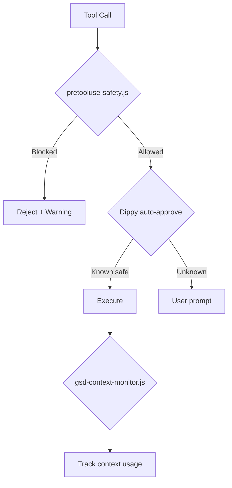

# claude-code-dotfiles

Production-ready Claude Code configuration with GSD workflow, multi-agent coordination, 28 plugins across 4 marketplaces, comprehensive MCP tools, and installer self-healing for stale hook caches.

## Table of Contents

- [Highlights](#highlights)
- [Quick Start](#quick-start)
- [What's Included](#whats-included)
- [Safety System](#safety-system)
- [Documentation](#documentation)
- [Troubleshooting](#troubleshooting)
- [Requirements](#requirements)
- [Contributing](#contributing)
- [License](#license)

## Highlights

- GSD (Get Shit Done) workflow with 34 commands for full project lifecycle management
- Multi-agent coordination with 12 specialized agents and wave-based parallelization
- Comprehensive MCP tools via [HakanMCP](https://github.com/sudohakan/HakanMCP) integration (DB, Git, AI, monitoring, orchestration)
- 3-layer safety system (Dippy auto-approve, pretooluse-safety blocker, context monitor)
- Auto-update with version tracking and dotfiles sync

## Quick Start

**Windows (PowerShell):**

```powershell
git clone https://github.com/sudohakan/claude-code-dotfiles.git C:\dev\claude-code-dotfiles
PowerShell -ExecutionPolicy Bypass -File "C:\dev\claude-code-dotfiles\install.ps1"
claude login
```

**Linux/macOS (Bash):**

```bash
git clone https://github.com/sudohakan/claude-code-dotfiles.git ~/dev/claude-code-dotfiles
bash ~/dev/claude-code-dotfiles/install.sh
claude login
```

> For detailed installation steps, see [SETUP.md](SETUP.md)

## What's Included

<details>
<summary><strong>Hooks and Safety System (7 hooks)</strong></summary>

Every tool call passes through a multi-layer hook pipeline:

| Hook | Type | Description |
|------|------|-------------|
| **Dippy** | PreToolUse | Smart bash auto-approve (Python, 14K+ tests). Auto-approves safe commands (`ls`, `git status`, `npm test`), flags risky ones |
| **pretooluse-safety.js** | PreToolUse | Blocks destructive git/fs/db commands, credential leaks (AWS, GitHub, OpenAI, Slack, Stripe, SendGrid, HuggingFace, private keys, JWT), unicode injection (zero-width, bidi override, Cyrillic homoglyph) |
| **gsd-context-monitor.js** | PostToolUse | Tracks context budget usage with thresholds at 45%, 55%, 65%, 75%, 85%, 90% |
| **gsd-statusline.js** | StatusLine | Renders profile, phase, and context percentage |
| **gsd-check-update.js** | SessionStart | Checks for GSD version updates on session start |
| **dotfiles-check-update.js** | SessionStart | Checks for dotfiles version updates on session start |
| **post-autoformat.js** | PostToolUse | Code formatting via Prettier (disabled by default) |

**Hook execution order:**

```
SessionStart  ->  gsd-check-update.js             GSD version check
PreToolUse    ->  dippy                            Auto-approve safe bash commands
              ->  pretooluse-safety.js             Block dangerous commands / credentials / unicode
PostToolUse   ->  gsd-context-monitor.js           Track context budget %
StatusLine    ->  gsd-statusline.js                Render profile + phase + context %
```

Safety details:
- Session-based allowlist remembers approved dangerous commands (12h TTL)
- Credentials and unicode injection are always hard-blocked (no allowlist bypass)
- Self-test: `node ~/.claude/hooks/pretooluse-safety.js --test` (30 tests)
- Optional data exfiltration detection (curl POST, scp, netcat, rsync) via `ENABLE_EXFILTRATION_CHECK`

</details>

<details>
<summary><strong>GSD Commands (34 commands)</strong></summary>

Full project lifecycle management:

| Stage | Command | Description |
|-------|---------|-------------|
| **Init** | `/gsd:new-project` | Scaffold ROADMAP.md and STATE.md |
| **Plan** | `/gsd:discuss-phase` | Gather context and discuss phase approach |
| | `/gsd:plan-phase` | Create phase plan (PLAN.md) |
| | `/gsd:research-phase` | Phase-specific research |
| | `/gsd:list-phase-assumptions` | List assumptions for a phase |
| | `/gsd:validate-phase` | Validate phase plan |
| **Execute** | `/gsd:execute-phase` | Run with wave-based agent parallelization |
| | `/gsd:auto-phase` | Full cycle (plan+execute+verify) for one or range of phases |
| | `/gsd:run-phase` | Plan+execute in one step (no verify) |
| | `/gsd:quick` | Skip planning for small tasks |
| **Verify** | `/gsd:verify-work` | Conversational UAT validation |
| | `/gsd:add-tests` | Add tests for current work |
| **Debug** | `/gsd:debug` | Systematic debugging with dedicated agent |
| **Track** | `/gsd:progress` | Status check and next-action routing |
| | `/gsd:health` | Project health check |
| | `/gsd:check-todos` | Check outstanding TODOs |
| **Phase Mgmt** | `/gsd:add-phase` | Add a new phase to roadmap |
| | `/gsd:insert-phase` | Insert phase at specific position |
| | `/gsd:remove-phase` | Remove a phase |
| **Milestone** | `/gsd:new-milestone` | Create a new milestone |
| | `/gsd:complete-milestone` | Mark milestone as complete |
| | `/gsd:audit-milestone` | Audit milestone progress |
| | `/gsd:plan-milestone-gaps` | Plan gaps in milestone |
| **Workflow** | `/gsd:pause-work` | Pause current work |
| | `/gsd:resume-work` | Resume paused work |
| | `/gsd:cleanup` | Clean up project artifacts |
| | `/gsd:reapply-patches` | Reapply patches |
| **Config** | `/gsd:set-profile` | Set GSD profile (budget/balanced/quality) |
| | `/gsd:settings` | View/edit GSD settings |
| | `/gsd:update` | Update GSD to latest version |
| **Tools** | `/gsd:map-codebase` | Map codebase structure |
| | `/gsd:add-todo` | Add a TODO item |
| | `/gsd:help` | Show GSD help |
| | `/gsd:join-discord` | Join GSD Discord community |

**Profile auto-selection:** `budget` (fix/typo) -- `balanced` (standard dev) -- `quality` (architecture/new project)

</details>

<details>
<summary><strong>Utility and Git Commands (10 commands)</strong></summary>

| Command | Category | Description |
|---------|----------|-------------|
| `/commit` | Git | Conventional commit with message generation |
| `/create-pr` | Git | Branch, commit, push, and create PR |
| `/fix-github-issue` | Git | Fetch and fix a GitHub issue |
| `/fix-pr` | Git | Fix PR review comments |
| `/release` | Git | Version bump, changelog update, tag |
| `/run-ci` | Git | Auto-detect and run CI checks |
| `/ship` | Git | End-to-end git workflow |
| `/init-hakan` | Utility | Project scaffolding (creates `.planning/` and `.memory/` structure) |
| `/browser` | Utility | Playwright MCP browser launcher |
| `/dotfiles-update` | Utility | Auto-update dotfiles from GitHub |

</details>

<details>
<summary><strong>Agents (12 specialized)</strong></summary>

| Agent | Role |
|-------|------|
| **gsd-planner** | Phase planning and task breakdown |
| **gsd-executor** | Code implementation |
| **gsd-debugger** | Bug investigation and root cause analysis |
| **gsd-verifier** | Quality verification and UAT |
| **gsd-phase-researcher** | Phase-specific research |
| **gsd-project-researcher** | Project-wide context gathering |
| **gsd-plan-checker** | Plan completeness validation |
| **gsd-integration-checker** | Cross-component verification |
| **gsd-codebase-mapper** | Codebase structure analysis |
| **gsd-roadmapper** | Roadmap generation |
| **gsd-research-synthesizer** | Multi-source research aggregation |
| **gsd-nyquist-auditor** | Quality and frequency auditing |

**Coordination features:**
- Dependency-driven eager wave execution for parallel task scheduling
- Quality gates between agent handoffs
- Context-aware model routing: haiku (simple search) -> sonnet (standard) -> opus (deep analysis)
- Failure protocols and automatic recovery

</details>

<details>
<summary><strong>Skills & Plugins (4 marketplaces, 28 plugins)</strong></summary>

**Bundled Skill Sets (local):**

| Skill Set | Description |
|-----------|-------------|
| **cc-devops-skills** | DevOps: infrastructure as code, CI/CD, cloud platforms |
| **trailofbits-security** | Security: static analysis, audit, vulnerability scanning |
| **ui-ux-pro-max** | UI/UX design system: 67 styles, 96 palettes, 13 tech stacks |
| **community-skills** | 4 community skills from [awesome-claude-skills](https://github.com/travisvn/awesome-claude-skills) |

**Community Skills (4 standalone):**

| Skill | Source | Description |
|-------|--------|-------------|
| **d3js-visualization** | [chrisvoncsefalvay/claude-d3js-skill](https://github.com/chrisvoncsefalvay/claude-d3js-skill) | D3.js data visualization (charts, graphs, network diagrams, heatmaps) |
| **web-asset-generator** | [alonw0/web-asset-generator](https://github.com/alonw0/web-asset-generator) | Favicon, app icon, Open Graph social media image generation |
| **frontend-slides** | [zarazhangrui/frontend-slides](https://github.com/zarazhangrui/frontend-slides) | Animation-rich HTML presentations from scratch or PPT conversion |
| **ffuf-web-fuzzing** | [jthack/ffuf_claude_skill](https://github.com/jthack/ffuf_claude_skill) | Web fuzzing for penetration testing with auto-calibration |

**Plugin Marketplaces:**

| Marketplace | Source | Plugins |
|-------------|--------|---------|
| **claude-plugins-official** | `anthropics/claude-plugins-official` | 15 plugins |
| **trailofbits** | `trailofbits/skills` | 11 plugins |
| **anthropic-agent-skills** | `anthropics/skills` | 3 plugins (document-skills, example-skills, claude-api) |

**Enabled Plugins (28 total):**

| Plugin | Marketplace | Description |
|--------|-------------|-------------|
| context7 | official | Library documentation lookup |
| code-review | official | Code review workflows |
| superpowers | official | 20+ core skills (TDD, debugging, brainstorming, plans) |
| feature-dev | official | Guided feature development |
| ralph-loop | official | Continuous code review loop |
| typescript-lsp | official | TypeScript language server |
| playwright | official | Browser automation (disabled by default) |
| frontend-design | official | Production-grade frontend UI design |
| skill-creator | official | Create and improve custom skills |
| commit-commands | official | Git commit + push + PR automation |
| code-simplifier | official | Refactor for clarity and reduce complexity |
| pr-review-toolkit | official | 6 specialized PR review agents |
| security-guidance | official | Security context and guidance |

| claude-md-management | official | Audit and improve CLAUDE.md files |
| static-analysis | trailofbits | Semgrep + CodeQL scanning |
| differential-review | trailofbits | Security-focused diff review |
| insecure-defaults | trailofbits | Detect fail-open insecure defaults |
| sharp-edges | trailofbits | Identify error-prone APIs and footguns |
| supply-chain-risk-auditor | trailofbits | Dependency risk assessment |
| audit-context-building | trailofbits | Deep code analysis for security audit |
| property-based-testing | trailofbits | Generate property-based tests (fast-check) |
| variant-analysis | trailofbits | Find similar vulnerabilities across codebase |
| spec-to-code-compliance | trailofbits | Verify code implements specifications |
| git-cleanup | trailofbits | Safe worktree and branch cleanup |
| workflow-skill-design | trailofbits | Multi-step workflow skill patterns |
| document-skills | anthropic | Excel, Word, PowerPoint, PDF processing |
| example-skills | anthropic | MCP builder, web artifacts, webapp testing, art, themes |
| claude-api | anthropic | Claude API and SDK documentation |

</details>

<details>
<summary><strong>Memory and Context (6 files)</strong></summary>

Cross-project knowledge base stored in `~/.claude/projects/<project-key>/.memory/`:

| File | Purpose |
|------|---------|
| `MEMORY.md` | Main memory index |
| `session-continuity.md` | Session state for resume (`claude --continue`) |
| `auto-checkpoint.md` | Auto-checkpoint data |
| `decisions.md` | Architectural decisions |
| `patterns.md` | Recurring patterns |
| `solutions.md` | Bug fixes and root causes |

**Context engineering rules** enforced across all workflows:
- Write to filesystem, not context -- large outputs go to files
- Subagent isolation -- each subagent starts with clean context
- Lazy loading -- MCP tools loaded on-demand via ToolSearch
- Budget thresholds -- automatic checkpoints at 45%, 55%, 65%, 75%, 85%, 90%

</details>

<details>
<summary><strong>Project Structure</strong></summary>

```
claude-code-dotfiles/
├── install.ps1                                  # Windows installer (PowerShell)
├── install.sh                                   # Linux/macOS installer (Bash)
├── VERSION                                      # Current version (semver)
├── CHANGELOG.md                                 # Release history (Keep a Changelog)
├── CLAUDE.md                                    # Project-level instructions for this repo
├── SETUP.md                                     # Detailed setup guide
├── SECURITY.md                                  # Security policy
├── CONTRIBUTING.md                              # Contribution guidelines
├── LICENSE                                      # MIT license
├── .gitignore                                   # Git exclusions
├── .github/
│   └── workflows/
│       └── release.yml                          # Auto-release on version tag push
├── .claude/
│   └── commands/
│       └── sync-dotfiles.md                     # /sync-dotfiles — reverse sync to repo
├── home-config/
│   └── .claude.json                             # → ~/.claude.json (MCP server config)
└── config/                                      # → installs to ~/.claude/
    ├── CLAUDE.md                                # Global instructions (GSD, context, multi-agent)
    ├── settings.json                            # Hooks, MCP servers, permissions, model config
    ├── settings.local.json                      # Local overrides (gitignored)
    ├── package.json                             # GSD npm dependencies
    ├── gsd-file-manifest.json                   # GSD file tracking manifest
    ├── project-registry.json                    # Project discovery config (scan roots, recent)
    ├── agents/                                  # 12 GSD agent definitions
    │   ├── gsd-planner.md                       # Phase planning and task breakdown
    │   ├── gsd-executor.md                      # Code implementation
    │   ├── gsd-debugger.md                      # Bug investigation and root cause
    │   ├── gsd-verifier.md                      # Quality verification and UAT
    │   ├── gsd-phase-researcher.md              # Phase-specific research
    │   ├── gsd-project-researcher.md            # Project-wide context gathering
    │   ├── gsd-plan-checker.md                  # Plan completeness validation
    │   ├── gsd-integration-checker.md           # Cross-component verification
    │   ├── gsd-codebase-mapper.md               # Codebase structure analysis
    │   ├── gsd-roadmapper.md                    # Roadmap generation
    │   ├── gsd-nyquist-auditor.md               # Quality and frequency auditing
    │   └── gsd-research-synthesizer.md          # Multi-source research aggregation
    ├── commands/                                # Slash commands
    │   ├── init-hakan.md                        # /init-hakan — project scaffolding
    │   ├── browser.md                           # /browser — Playwright MCP browser launcher
    │   ├── commit.md                            # /commit — conventional commit
    │   ├── create-pr.md                         # /create-pr — branch, commit, push, PR
    │   ├── fix-github-issue.md                  # /fix-github-issue — fetch and fix issue
    │   ├── fix-pr.md                            # /fix-pr — fix PR review comments
    │   ├── release.md                           # /release — version bump, changelog, tag
    │   ├── run-ci.md                            # /run-ci — auto-detect and run CI checks
    │   ├── ship.md                              # /ship — end-to-end git workflow
    │   ├── dotfiles-update.md                   # /dotfiles-update — auto-update from GitHub
    │   └── gsd/                                 # 34 GSD workflow commands
    │       ├── new-project.md                   # Initialize project (ROADMAP + STATE)
    │       ├── plan-phase.md                    # Create phase plan (PLAN.md)
    │       ├── execute-phase.md                 # Execute with wave parallelization
    │       ├── debug.md                         # Systematic debugging
    │       ├── quick.md                         # Quick task (skip planning)
    │       ├── auto-phase.md                    # Full cycle (plan+execute+verify) for phases
    │       ├── run-phase.md                     # Plan+execute in one step
    │       ├── verify-work.md                   # UAT validation
    │       ├── progress.md                      # Status and next-action routing
    │       └── ... (25 more)                    # discuss, research, resume, pause, etc.
    ├── docs/                                    # 5 reference documents (loaded on-demand)
    │   ├── decision-matrix.md                   # Task → workflow routing rules
    │   ├── multi-agent.md                       # Parallel agent coordination protocol
    │   ├── tools-reference.md                   # External tool integration guide
    │   ├── ui-ux.md                             # UI/UX Pro Max design system
    │   └── review-ralph.md                      # Code review + Ralph Loop
    ├── hooks/                                   # 7 automation hooks
    │   ├── dippy/                               # Smart bash auto-approve (Python, 14K+ tests)
    │   ├── pretooluse-safety.js                 # Credential + destructive + unicode blocker
    │   ├── gsd-context-monitor.js               # Context budget tracking (45–90%)
    │   ├── gsd-statusline.js                    # Status line (profile, phase, context %)
    │   ├── gsd-check-update.js                  # GSD version check on session start
    │   ├── dotfiles-check-update.js             # Dotfiles version check on session start
    │   └── post-autoformat.js                   # Code formatting (disabled by default)
    ├── get-shit-done/                           # GSD runtime engine
    │   ├── VERSION                              # GSD version number
    │   ├── bin/                                 # Core libraries (gsd-tools.cjs)
    │   ├── references/                          # 13 workflow reference docs
    │   ├── templates/                           # Project and phase templates
    │   └── workflows/                           # Workflow step definitions
    ├── plugins/                                 # Plugin registry
    │   ├── blocklist.json                       # Blocked plugin list
    │   └── known_marketplaces.json              # 4 marketplace definitions (official, code, trailofbits, anthropic-skills)
    ├── skills/                                  # 4 skill sets
    │   ├── cc-devops-skills/                    # DevOps: IaC, CI/CD, cloud platforms
    │   ├── trailofbits-security/                # Security: static analysis, audit
    │   ├── ui-ux-pro-max/                       # UI/UX: 67 styles, 96 palettes, 13 stacks
    │   └── community-skills/                    # 4 community skills (d3js, web-assets, slides, ffuf)
    └── projects/                                # Per-project config and memory
        └── C--Users-Hakan/
            └── .memory/                         # Cross-project knowledge base
                ├── MEMORY.md                    # Main memory index
                ├── session-continuity.md        # Session state for resume
                ├── auto-checkpoint.md           # Auto-checkpoint data
                ├── decisions.md                 # Architectural decisions
                ├── patterns.md                  # Recurring patterns
                └── solutions.md                 # Bug fixes and root causes
```

</details>

## Safety System

Three layers protect every tool call from accidental damage:

| Layer | Hook | What It Catches |
|------:|------|-----------------|
| 1 | **Dippy** | Auto-approves safe commands (`ls`, `git status`, `npm test`), flags risky ones |
| 2 | **pretooluse-safety.js** | Destructive git/fs/db commands, credential leaks (AWS, GitHub, OpenAI, Slack, Stripe, SendGrid, HuggingFace, private keys, JWT), unicode injection (zero-width, bidi override, Cyrillic homoglyph) |
| 3 | *(optional)* | Data exfiltration detection (curl POST, scp, netcat, rsync) -- disabled by default via `ENABLE_EXFILTRATION_CHECK` |



**Security highlights:**
- No credentials in repo -- OAuth tokens generated per-machine via `claude login`
- Credential detection hook blocks accidental exposure of API keys in commands
- Path auto-fix -- install script replaces hardcoded paths with current username
- Git safety -- commits and pushes require explicit user approval

## Documentation

| Document | Description |
|----------|-------------|
| [SETUP.md](SETUP.md) | Installation and configuration guide |
| [CONTRIBUTING.md](CONTRIBUTING.md) | How to contribute |
| [SECURITY.md](SECURITY.md) | Security policy and vulnerability reporting |
| [CHANGELOG.md](CHANGELOG.md) | Version history |

## Troubleshooting

| Issue | Solution |
|-------|----------|
| `claude: command not found` | `npm install -g @anthropic-ai/claude-code` or restart terminal |
| Hooks not running | Check `~/.claude/settings.json` paths. Run `node ~/.claude/hooks/pretooluse-safety.js --test` |
| Dippy not auto-approving | Ensure Python 3.8+ is installed: `python --version` |
| Safety hook false positive | `node ~/.claude/hooks/pretooluse-safety.js --approve "command"` |
| GSD commands missing | Verify `~/.claude/commands/gsd/` exists with `.md` files |
| GSD workflows failing | Ensure `jq` is installed: `jq --version` (used by GSD workflows) |
| Path errors after install | Re-run `install.ps1` -- auto-fixes paths for your username |
| Plugin install fails | Run `claude plugins install "plugin-name"` manually |
| `UserPromptSubmit operation blocked by hook` | Re-run `install.ps1` or `install.sh`. As of `v1.14.1`, the installer recreates missing stale `hookify` `userpromptsubmit.py` files automatically |
| `CLAUDE.md` not loading | Must be in `~/.claude/CLAUDE.md` (global) or project root (project-level) |
| Session continuity missing | Run `/init-hakan` in project to create memory structure |
| HakanMCP connection error | Check `C:\dev\HakanMCP`. Re-run `install.ps1` or use `-SkipHakanMCP` |
| Dotfiles update not showing | Check `~/.claude/dotfiles-meta.json` exists. Re-run install script to create it |
| `/dotfiles-update` fails | Verify repo path in `~/.claude/dotfiles-meta.json` is correct and accessible |

## Requirements

- **OS:** Windows 10/11 (Linux/macOS via `install.sh`)
- **Node.js:** v20+ (auto-installed)
- **Python:** 3.8+ (auto-installed; required for Dippy hook)
- **Git:** Any recent version (auto-installed)
- **Claude Code:** Installed automatically by the script

## Contributing

We welcome contributions! Please read [CONTRIBUTING.md](CONTRIBUTING.md) for development setup, commit conventions, and pull request guidelines.

## License

[MIT](LICENSE) -- 2026 Hakan

---

<p align="center">
  Built with <a href="https://docs.anthropic.com/en/docs/claude-code">Claude Code</a>
</p>
