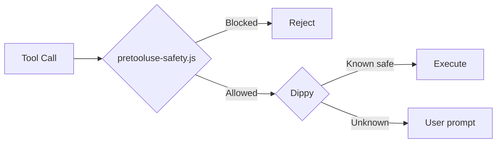

<div align="center">

# claude-code-dotfiles

**Production-ready Claude Code configuration — batteries included.**


<br>

| Agents | Commands | Skills | Rules | Hooks | Team Roles |
|:------:|:--------:|:------:|:-----:|:-----:|:----------:|
| **37** | **118** | **51** | **50** | **18** | **17** |

[Quick Start](#-quick-start) &bull; [What's Inside](#-whats-inside) &bull; [Safety](#-safety-system) &bull; [Sync](#-keeping-in-sync) &bull; [Docs](#-documentation)

</div>

---

## Highlights

- **GSD Workflow** &mdash; 34 phase-based commands covering plan, execute, verify, debug, and milestone management
- **37 Specialized Agents** &mdash; language reviewers, build resolvers, planners, architects, security reviewers, and more
- **118 Slash Commands** &mdash; language-specific build/test/review, session persistence, multi-model workflows, team orchestration
- **51 Skill Sets** &mdash; framework patterns (Django, Laravel, Spring Boot, Kotlin), testing, TDD, verification, continuous learning
- **50 Coding Rules** across 9 languages (TypeScript, Python, Go, Rust, Kotlin, C++, Swift, PHP, Perl) + common standards
- **3-Layer Safety** &mdash; Dippy auto-approve, credential blocker, unicode injection protection
- **Automated Sync** &mdash; `sync.sh` keeps the repo matched with your live configuration
- **MCP Integration** &mdash; [HakanMCP](https://github.com/sudohakan/HakanMCP) + 31 server templates ready to connect

---

## Quick Start

<table>
<tr>
<td width="50%">

**Windows (PowerShell)**

```powershell
git clone https://github.com/sudohakan/claude-code-dotfiles.git C:\dev\claude-code-dotfiles
PowerShell -ExecutionPolicy Bypass -File "C:\dev\claude-code-dotfiles\install.ps1"
claude login
```

</td>
<td width="50%">

**Linux / macOS (Bash)**

```bash
git clone https://github.com/sudohakan/claude-code-dotfiles.git ~/dev/claude-code-dotfiles
bash ~/dev/claude-code-dotfiles/install.sh
claude login
```

</td>
</tr>
</table>

> **WSL users:** Run `bash setup-wsl-claude.sh` for full environment setup (Node.js, Claude CLI, symlinks, tmux, SSH, Tailscale).

See [SETUP.md](SETUP.md) for detailed installation steps, parameters, and what each step does.

---

## What's Inside

<details>
<summary><h3>Agents (37 specialized)</h3></summary>

<table>
<tr><th>Category</th><th>Agents</th><th>Purpose</th></tr>
<tr><td rowspan="6"><strong>Language Reviewers</strong></td>
<td>go-reviewer</td><td>Idiomatic Go, concurrency, error handling</td></tr>
<tr><td>python-reviewer</td><td>PEP 8, type hints, Pythonic idioms</td></tr>
<tr><td>rust-reviewer</td><td>Ownership, lifetimes, unsafe usage</td></tr>
<tr><td>cpp-reviewer</td><td>Memory safety, modern C++, concurrency</td></tr>
<tr><td>java-reviewer</td><td>Spring Boot patterns, JPA, concurrency</td></tr>
<tr><td>kotlin-reviewer</td><td>Coroutine safety, Compose, clean architecture</td></tr>
<tr><td rowspan="5"><strong>Build Resolvers</strong></td>
<td>build-error-resolver</td><td>TypeScript/JS build errors</td></tr>
<tr><td>go-build-resolver</td><td>Go build, vet, linter issues</td></tr>
<tr><td>rust-build-resolver</td><td>Cargo build, borrow checker</td></tr>
<tr><td>cpp-build-resolver</td><td>CMake, linker, template errors</td></tr>
<tr><td>kotlin-build-resolver</td><td>Gradle, Kotlin compiler errors</td></tr>
<tr><td rowspan="5"><strong>Core Workflow</strong></td>
<td>planner</td><td>Implementation planning for complex features</td></tr>
<tr><td>architect</td><td>System design and architectural decisions</td></tr>
<tr><td>code-reviewer</td><td>Post-implementation quality review</td></tr>
<tr><td>security-reviewer</td><td>OWASP Top 10, vulnerability detection</td></tr>
<tr><td>tdd-guide</td><td>Test-driven development enforcement</td></tr>
<tr><td rowspan="4"><strong>Specialists</strong></td>
<td>database-reviewer</td><td>PostgreSQL, query optimization, schema design</td></tr>
<tr><td>e2e-runner</td><td>Playwright E2E test generation and execution</td></tr>
<tr><td>doc-updater</td><td>Documentation and codemap maintenance</td></tr>
<tr><td>refactor-cleaner</td><td>Dead code removal and consolidation</td></tr>
<tr><td><strong>GSD Workflow</strong></td>
<td colspan="2">12 agents: planner, executor, debugger, verifier, researchers, roadmapper, integration-checker, and more</td></tr>
</table>

</details>

<details>
<summary><h3>Commands (118 slash commands)</h3></summary>

**GSD Workflow (34 commands)**

| Stage | Commands |
|-------|----------|
| **Init** | `new-project` |
| **Plan** | `discuss-phase`, `plan-phase`, `research-phase`, `list-phase-assumptions`, `validate-phase` |
| **Execute** | `execute-phase`, `auto-phase`, `run-phase`, `quick` |
| **Verify** | `verify-work`, `add-tests` |
| **Debug** | `debug` |
| **Track** | `progress`, `health`, `check-todos` |
| **Phase** | `add-phase`, `insert-phase`, `remove-phase` |
| **Milestone** | `new-milestone`, `complete-milestone`, `audit-milestone`, `plan-milestone-gaps` |
| **Workflow** | `pause-work`, `resume-work`, `cleanup`, `reapply-patches` |
| **Config** | `set-profile`, `settings`, `update` |
| **Tools** | `map-codebase`, `add-todo`, `help`, `join-discord` |

**Language-Specific (20 commands)**

| Language | Build | Review | Test |
|----------|:-----:|:------:|:----:|
| Go | `/go-build` | `/go-review` | `/go-test` |
| Rust | `/rust-build` | `/rust-review` | `/rust-test` |
| C++ | `/cpp-build` | `/cpp-review` | `/cpp-test` |
| Kotlin | `/kotlin-build` | `/kotlin-review` | `/kotlin-test` |
| Python | &mdash; | `/python-review` | &mdash; |
| Gradle | `/gradle-build` | &mdash; | &mdash; |

**Git & CI/CD (7 commands)**

`/commit` &bull; `/create-pr` &bull; `/fix-github-issue` &bull; `/fix-pr` &bull; `/release` &bull; `/run-ci` &bull; `/ship`

**Session & Learning (10 commands)**

`/save-session` &bull; `/resume-session` &bull; `/sessions` &bull; `/learn` &bull; `/learn-eval` &bull; `/evolve` &bull; `/instinct-status` &bull; `/instinct-import` &bull; `/instinct-export` &bull; `/checkpoint`

**Multi-Model Workflows (5 commands)**

`/multi-plan` &bull; `/multi-execute` &bull; `/multi-backend` &bull; `/multi-frontend` &bull; `/multi-workflow`

**Quality & Security (7 commands)**

`/plan` &bull; `/tdd` &bull; `/verify` &bull; `/code-review` &bull; `/security-scan` &bull; `/quality-gate` &bull; `/test-coverage`

**Team & Orchestration (3 commands)**

`/team` &bull; `/devfleet` &bull; `/orchestrate`

**Utilities (12+ commands)**

`/status` &bull; `/browser` &bull; `/deploy` &bull; `/docs` &bull; `/aside` &bull; `/add-mcp` &bull; `/prompt-optimize` &bull; `/refactor-clean` &bull; `/e2e` &bull; `/build-fix` &bull; `/update-docs` &bull; `/update-codemaps`

</details>

<details>
<summary><h3>Skills (51 skill sets)</h3></summary>

| Category | Skills |
|----------|--------|
| **Framework Patterns** | Django, Laravel, Spring Boot, Kotlin (Ktor, Exposed, Coroutines, Compose Multiplatform) |
| **Language Patterns** | Python, Go, Rust, C++, Java, Kotlin, Perl, TypeScript |
| **Testing & TDD** | Python, Go, Rust, C++, Kotlin, Django, Laravel, Spring Boot, E2E (Playwright) |
| **Verification** | Django, Laravel, Spring Boot verification loops |
| **Quality** | TDD workflow, verification loop, eval harness, plankton code quality, AI regression testing |
| **DevOps** | cc-devops-skills (Terraform, Ansible, Docker, Helm, K8s, GitHub Actions, Azure Pipelines) |
| **Security** | Trail of Bits security plugins (40+ static analysis, audit, supply chain) |
| **UI/UX** | UI/UX Pro Max (67 styles, 96 palettes, 57 font pairings, 13 tech stacks), frontend slides |
| **Learning** | Continuous learning v1 & v2, skill stocktake, strategic compact |
| **Architecture** | Android clean architecture, API design, backend patterns, frontend patterns, MCP server patterns |
| **Community** | D3.js visualization, web asset generator, frontend slides, ffuf web fuzzing |

</details>

<details>
<summary><h3>Rules (50 files across 9 languages)</h3></summary>

**Common rules** apply to all projects. **Language packs** extend them with idioms and tooling.

| Language | Files | Covers |
|----------|:-----:|--------|
| **Common** | 9 | Coding style, git workflow, testing, security, performance, patterns, agents, hooks |
| **TypeScript** | 5 | ESLint, Prettier, React patterns, type safety, Jest |
| **Python** | 5 | PEP 8, Black, mypy, pytest, security scanning |
| **Go** | 5 | gofmt, go vet, table-driven tests, error handling |
| **Rust** | 5 | clippy, cargo fmt, ownership patterns, unsafe review |
| **Kotlin** | 5 | ktlint, coroutines, Compose, Kotest, Kover |
| **C++** | 5 | clang-format, sanitizers, GoogleTest, RAII |
| **Swift** | 5 | SwiftFormat, SwiftLint, XCTest, actors |
| **PHP** | 5 | PHP-CS-Fixer, PHPStan, PHPUnit, Laravel |
| **Perl** | 5 | perltidy, perlcritic, Test2::V0, Devel::Cover |

Rules are installed per-language: `./install.sh typescript python`

</details>

<details>
<summary><h3>Hooks (18 automation hooks)</h3></summary>

```
SessionStart  ->  rotate-hook-approvals.js      Rotate approval tokens
              ->  retention-cleanup.js           Clean old data
              ->  hook-health-check.js           Verify hook integrity
              ->  team-active-reminder.js        Team status notification
              ->  mcp-reconnect.js               Reconnect MCP servers (30s timeout)

PreToolUse    ->  dippy                          Auto-approve safe bash commands
              ->  pretooluse-safety.js           Block credentials / destructive / unicode

TeammateIdle  ->  teammate-idle-check.js         Self-claiming nudge
TaskCompleted ->  task-completed-check.js        Verification gate
Stop          ->  session-end-check.js           Final verification

StatusLine    ->  context-statusline.sh          Profile + phase + context %
```

| Hook | What It Catches |
|------|-----------------|
| **Dippy** | Smart auto-approve (Python, 14K+ tests). Safe: `ls`, `git status`, `npm test`. Risky: flagged. |
| **pretooluse-safety.js** | Destructive git/fs/db, credential leaks (AWS, GitHub, OpenAI, Slack, Stripe, etc.), unicode injection |
| **mcp-reconnect.js** | Detects disconnected MCP servers and reconnects on session start |
| **session-end-check.js** | Ensures verification ran before session close |

</details>

<details>
<summary><h3>Agent Teams (17 roles)</h3></summary>

Mesh-model coordination with self-claiming, plan approval, and hook-enforced quality gates.

| Role | Focus |
|------|-------|
| tech-lead | Technical leadership, code review, architectural decisions |
| fullstack-dev | Full-stack implementation across frontend and backend |
| product-manager | Requirements, scope, stakeholder alignment |
| backend-architect | Backend system design, API patterns, data modeling |
| cloud-architect | Cloud infrastructure, scalability, cost optimization |
| devops | CI/CD pipelines, deployment, infrastructure as code |
| security-engineer | Security analysis, penetration testing, hardening |
| qa-tester | Test strategy, automation, quality assurance |
| ui-ux-designer | Interface design, user experience, accessibility |
| launch-ops | Deployment coordination, rollback planning, monitoring |
| research-lead | Research coordination, technical spikes, POCs |
| observability-engineer | Monitoring, alerting, distributed tracing |
| analytics-optimizer | Performance metrics, A/B testing, data analysis |
| business-analyst | Business requirements, process mapping, ROI analysis |
| content-strategist | Content planning, editorial, messaging |
| growth-lead | Growth experiments, funnel optimization, retention |
| social-media-operator | Social media campaigns, scheduling, analytics |

Create teams with `/team` &mdash; compose any combination of roles.

</details>

<details>
<summary><h3>MCP Integration</h3></summary>

**Active Servers (configured in settings.json):**

| Server | Purpose |
|--------|---------|
| **HakanMCP** | DB queries, API testing, system monitoring, backup, 10 on-demand servers |
| **Playwright** | Browser automation, UI testing, web scraping |
| **container-use** | Docker container operations |
| **NotebookLM** | Deep research, multi-source synthesis, audio/video generation |

**31 Additional Templates** ready to enable in `config/mcp-configs/mcp-servers.json`:

GitHub, Firecrawl, Supabase, Memory, Sequential-thinking, Vercel, Railway, Cloudflare (4 endpoints), ClickHouse, Exa, Context7, Magic UI, Filesystem, FAL.ai, Browserbase, Browser-use, DevFleet, and more.

</details>

<details>
<summary><h3>Memory & Context Engineering</h3></summary>

Cross-project knowledge base at `~/.claude/projects/<project-key>/.memory/`:

| File | Purpose |
|------|---------|
| `MEMORY.md` | Main memory index |
| `session-continuity.md` | Session state for `/resume-session` |
| `decisions.md` | Architectural decisions log |
| `patterns.md` | Recurring project patterns |
| `solutions.md` | Non-obvious fixes and root causes |

**Context rules enforced across all workflows:**
- Write to filesystem, not context &mdash; large outputs go to files
- Subagent isolation &mdash; each subagent starts with clean context
- Lazy loading &mdash; MCP tools loaded on-demand via ToolSearch
- Budget thresholds &mdash; automatic checkpoints at 45%, 55%, 65%, 75%, 85%, 90%

</details>

---

## Safety System

Three layers protect every tool call:



| Layer | What It Catches |
|:-----:|-----------------|
| **1** | Credential leaks (AWS, GitHub, OpenAI, Slack, Stripe, SendGrid, HuggingFace, private keys, JWT) |
| **2** | Destructive commands (`rm -rf /`, `git push --force`, `DROP TABLE`, etc.) |
| **3** | Unicode injection (zero-width chars, bidi overrides, Cyrillic homoglyphs) |

- No credentials in repo &mdash; OAuth tokens generated per-machine
- Path auto-fix &mdash; installer replaces hardcoded paths with your username
- Git safety &mdash; commits and pushes always require explicit approval
- Self-test: `node ~/.claude/hooks/pretooluse-safety.js --test`

---

## Keeping in Sync

After modifying your live `~/.claude/` configuration, sync changes back to the repo:

```bash
cd /path/to/claude-code-dotfiles

# Preview what would change
bash sync.sh --dry-run

# Full sync
bash sync.sh

# Review and commit
git diff --stat
git add -A && git commit -m "chore: sync from live"
```

The sync script copies agents, commands, docs, hooks, rules, skills, teams, MCP configs, and core settings &mdash; excluding runtime state, caches, and credentials.

---

## Project Structure

```
claude-code-dotfiles/
├── install.ps1              Windows installer (PowerShell)
├── install.sh               Linux/macOS installer (Bash)
├── setup-wsl-claude.sh      WSL-specific environment setup
├── sync.sh                  Live → repo synchronization
├── VERSION                  Current version (3.0.0)
├── home-config/
│   └── .claude.json         MCP server configuration template
└── config/                  Installs to ~/.claude/
    ├── CLAUDE.md            Global instructions
    ├── settings.json        Hooks, plugins, MCP, permissions
    ├── agents/              37 agent definitions
    ├── commands/            84 commands + gsd/ (34) + deprecated/
    ├── docs/                15 reference documents
    ├── hooks/               18 hook scripts + lib/
    ├── rules/               50 files (common/ + 8 language packs)
    ├── skills/              51 skill sets (1000+ files)
    ├── teams/agents/        17 team role definitions
    ├── mcp-configs/         31 MCP server templates
    ├── get-shit-done/       GSD runtime engine
    └── plugins/             Plugin registry config
```

---

## Documentation

| Document | Description |
|----------|-------------|
| [SETUP.md](SETUP.md) | Installation guide with step-by-step walkthrough |
| [CONTRIBUTING.md](CONTRIBUTING.md) | How to contribute, code style, PR process |
| [SECURITY.md](SECURITY.md) | Security policy and vulnerability reporting |
| [CHANGELOG.md](CHANGELOG.md) | Full version history |

---

## Troubleshooting

<details>
<summary><strong>Claude Code not found</strong></summary>

```bash
npm install -g @anthropic-ai/claude-code
```
Restart your terminal after installing.
</details>

<details>
<summary><strong>Hooks not running</strong></summary>

Check that `~/.claude/settings.json` has correct paths. Run the self-test:
```bash
node ~/.claude/hooks/pretooluse-safety.js --test
```
</details>

<details>
<summary><strong>Dippy not auto-approving</strong></summary>

Ensure Python 3.8+ is installed: `python --version`. Dippy is cloned separately during install.
</details>

<details>
<summary><strong>GSD commands missing</strong></summary>

Verify `~/.claude/commands/gsd/` contains `.md` files. Re-run the installer if empty.
</details>

<details>
<summary><strong>MCP server connection errors</strong></summary>

Check server status in `~/.claude/settings.json`. The `mcp-reconnect.js` hook auto-reconnects on session start. For HakanMCP: verify `C:\dev\HakanMCP` exists and is built (`npm run build`).
</details>

<details>
<summary><strong>Path errors after install</strong></summary>

Re-run the installer &mdash; Step 7 auto-fixes all paths for your username.
</details>

<details>
<summary><strong>Session continuity missing</strong></summary>

Run `/init-hakan` in your project to create the memory structure.
</details>

---

## Requirements

| Requirement | Version | Notes |
|-------------|---------|-------|
| **OS** | Windows 10/11, macOS, Linux | WSL supported via `setup-wsl-claude.sh` |
| **Node.js** | v20+ | Auto-installed by installer |
| **Python** | 3.8+ | Required for Dippy hook |
| **Git** | Any recent | Auto-installed by installer |
| **Claude Code** | Latest | Auto-installed by installer |

---

## Contributing

Contributions welcome! See [CONTRIBUTING.md](CONTRIBUTING.md) for setup, conventions, and PR guidelines.

---

<div align="center">

## License

[MIT](LICENSE) &mdash; 2026 Hakan

Built with [Claude Code](https://docs.anthropic.com/en/docs/claude-code)

</div>
